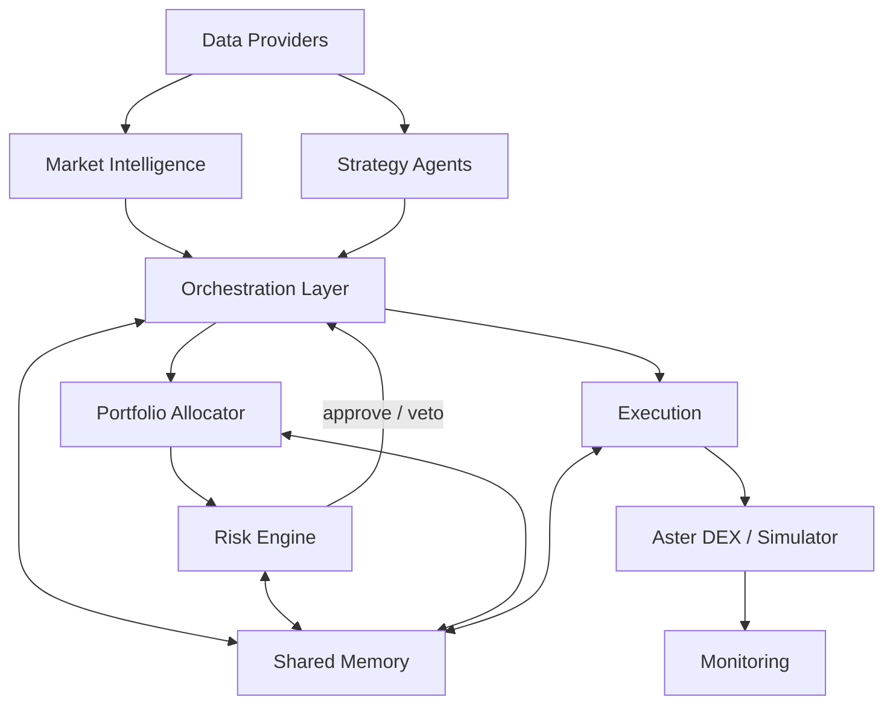

# Architecture

## System Diagram

## Control Boundary

No executable order may leave orchestration without passing centralized risk validation. Execution components accept only pre-approved order intents carrying a risk approval token.
