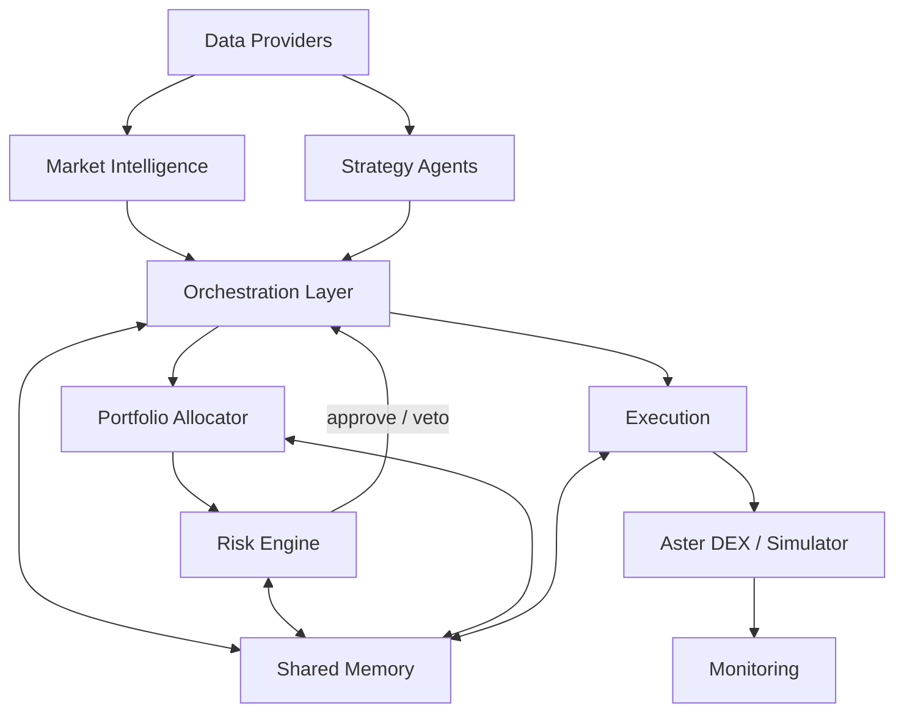

# Autonomous Investment Swarm (AIS)

[](https://github.com/kmshihab7878/Financial-Intelligence-Department-FID/actions)
[]()
[](https://www.python.org/downloads/)
[](https://docs.astral.sh/ruff/)
[](http://mypy-lang.org/)
[]()
[](LICENSE)

An experimental autonomous trading system built around risk-gated multi-agent orchestration. AIS coordinates specialist strategy agents through a governed execution pipeline with mandatory risk validation before any order submission.

> **WARNING**: This software is experimental and intended for research and educational purposes. Trading cryptocurrencies involves substantial risk of loss. Never deploy with funds you cannot afford to lose. The authors accept no liability for financial losses incurred through use of this software.

---

## Table of Contents

- [Why AIS?](#why-ais)
- [Architecture](#architecture)
- [Prerequisites](#prerequisites)
- [Quick Start](#quick-start)
- [Configuration](#configuration)
- [Running Tests](#running-tests)
- [Example Output](#example-output)
- [Troubleshooting](#troubleshooting)
- [Contributing](#contributing)
- [Security](#security)
- [License](#license)

## Why AIS?

Most trading bots execute a single strategy with basic stop-losses. AIS takes a different approach:

- **Risk-gated execution** — Every order requires an HMAC-signed approval token from the risk engine. No token, no trade. The system fails closed, not open.
- **Mandate governance** — Strategies operate within explicit mandates that cap allocation, restrict instruments, and enforce position limits. Mandates are validated before every trading cycle.
- **Multi-agent arbitration** — Multiple strategy agents compete to generate signals. A weighted arbitration layer selects the best signal based on confidence, expected return, and liquidity — preventing conflicting positions.
- **Three execution modes** — Paper trading (simulated fills), shadow mode (read-only exchange connection), and live mode (gated behind explicit opt-in). Each mode shares the same pipeline, so what you test is what you deploy.

## Architecture



```
src/aiswarm/
├── agents/         # Strategy agents (momentum, funding rate)
├── api/            # FastAPI control plane (auth, routes, Prometheus)
├── bootstrap.py    # Config -> component graph wiring
├── data/           # EventStore (SQLite), Aster data provider
├── execution/      # Order executor, order store, fill tracker
├── loop/           # Autonomous trading loop (60s cycle)
├── mandates/       # Governance: mandate registry, validator
├── monitoring/     # Prometheus metrics, alerts, reconciliation
├── orchestration/  # Coordinator, arbitration, shared memory
├── portfolio/      # Allocator, exposure manager
├── quant/          # Kelly criterion, risk metrics, drift detection
├── resilience/     # Circuit breaker, rate limiter, graceful shutdown
├── risk/           # Risk engine, kill switch, drawdown, leverage checks
├── session/        # Session lifecycle management
└── types/          # Pydantic domain models (Signal, Order, Portfolio)
```

## Prerequisites

- Python 3.10+
- Redis (for control state)
- Docker and Docker Compose (optional, for full stack)

## Quick Start

### Local Development

```bash
python -m venv .venv
source .venv/bin/activate
pip install -r requirements.txt

# Copy and configure environment
cp .env.example .env
# Edit .env — at minimum set AIS_RISK_HMAC_SECRET

# Run API server
uvicorn aiswarm.api.app:app --app-dir src --reload

# Run trading loop (paper mode, default)
python -m aiswarm --config config/
```

### Docker

```bash
# Configure environment first
cp .env.example .env
# Edit .env with required values (see Configuration below)

docker compose up --build
```

## Configuration

AIS uses YAML configuration files in `config/`:

| File | Purpose |
|------|---------|
| `base.yaml` | Core system settings |
| `risk.yaml` | Risk limits, drawdown thresholds, leverage caps |
| `execution.yaml` | Execution mode, order routing |
| `mandates.yaml` | Strategy mandates, allowed assets, allocation limits |
| `portfolio.yaml` | Portfolio constraints, rebalancing rules |
| `monitoring.yaml` | Alerting, metrics, reconciliation |

### Required Environment Variables

| Variable | Purpose |
|----------|---------|
| `AIS_RISK_HMAC_SECRET` | HMAC key for risk token signing (always required) |
| `AIS_API_KEY` | Bearer token for API auth (live mode) |
| `AIS_EXECUTION_MODE` | `paper` / `shadow` / `live` (default: `paper`) |
| `REDIS_URL` | Redis connection (default: `redis://localhost:6379/0`) |

See `.env.example` for the full list.

### Execution Modes

- **Paper** (default): Simulated fills, no exchange connection
- **Shadow**: Read-only connection to exchange, no order submission
- **Live**: Real order submission (requires `AIS_ENABLE_LIVE_TRADING=true`)

## Running Tests

```bash
# Unit tests with coverage
pytest tests/unit/ -v --cov=src/aiswarm --cov-fail-under=83

# Lint
ruff check src/ tests/unit/
ruff format --check src/ tests/unit/

# Type check
mypy src/aiswarm/ --ignore-missing-imports
```

## Example Output

Paper trading loop output (structlog JSON):

```
{"event": "session_started", "mode": "paper", "strategies": ["momentum_ma_crossover", "funding_rate_contrarian"]}
{"event": "cycle_start", "cycle": 1, "timestamp": "2025-01-15T10:00:00Z"}
{"event": "signal_generated", "agent": "momentum", "symbol": "BTCUSDT", "direction": 1, "confidence": 0.72}
{"event": "risk_approved", "symbol": "BTCUSDT", "size": 0.001, "token": "hmac:a3f2..."}
{"event": "order_submitted", "symbol": "BTCUSDT", "side": "BUY", "qty": 0.001, "mode": "paper"}
{"event": "cycle_end", "cycle": 1, "duration_ms": 245}
```

## Troubleshooting

| Problem | Solution |
|---------|----------|
| `AIS_RISK_HMAC_SECRET not set` | Set the environment variable: `export AIS_RISK_HMAC_SECRET=$(python -c "import secrets; print(secrets.token_urlsafe(32))")` |
| `ConnectionError: Redis` | Start Redis: `redis-server` or `docker run -d -p 6379:6379 redis:7-alpine` |
| `ModuleNotFoundError: aiswarm` | Install in editable mode: `pip install -e .` from the repo root |
| Kill switch won't reset | Kill switch requires manual restart of the trading loop process |
| `401 Unauthorized` on API | Set `AIS_API_KEY` and pass as Bearer token: `curl -H "Authorization: Bearer $AIS_API_KEY"` |

## Contributing

See [CONTRIBUTING.md](CONTRIBUTING.md) for development setup and PR requirements.

## Security

See [SECURITY.md](SECURITY.md) for vulnerability reporting.

## License

Apache License 2.0. See [LICENSE](LICENSE).
