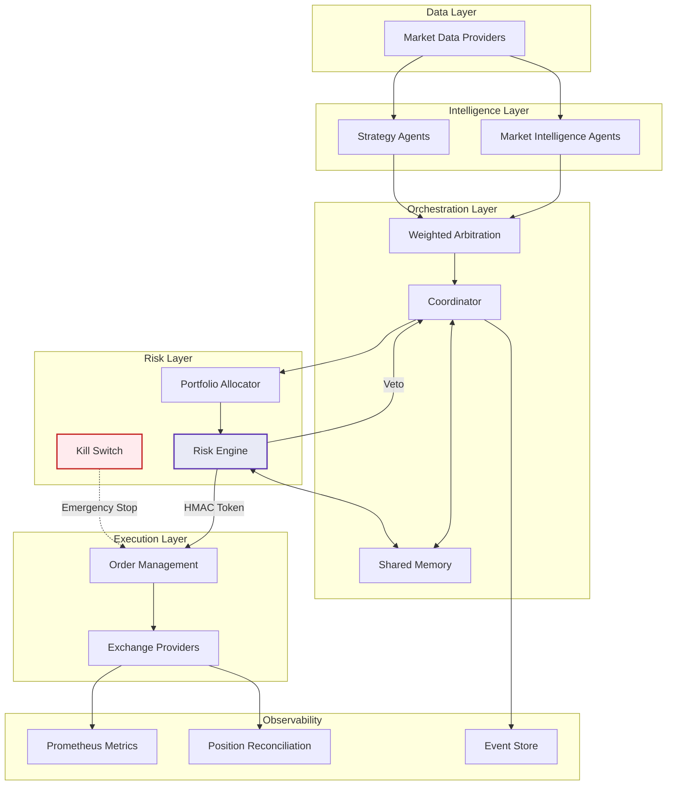

<p align="center">
  
</p>

<h1 align="center">Autonomous Investment Swarm</h1>

<p align="center">
  <strong>Risk-gated autonomous trading with multi-agent orchestration</strong><br>
  <em>Every order requires cryptographic risk approval. The system fails closed, not open.</em>
</p>

<p align="center">
  <a href="https://github.com/kmshihab7878/Autonomous-Investment-Swarm/actions/workflows/ci.yml"></a>
  <a href="https://kmshihab7878.github.io/Autonomous-Investment-Swarm/"></a>
  <a href="https://codecov.io/gh/kmshihab7878/Autonomous-Investment-Swarm"></a>
  <a href="https://www.python.org/downloads/"></a>
  <a href="https://docs.astral.sh/ruff/"></a>
  <a href="http://mypy-lang.org/"></a>
  <a href="https://github.com/kmshihab7878/Autonomous-Investment-Swarm/discussions"></a>
  <a href="LICENSE"></a>
</p>

<p align="center">
  <a href="https://kmshihab7878.github.io/Autonomous-Investment-Swarm/">Documentation</a> &middot;
  <a href="https://kmshihab7878.github.io/Autonomous-Investment-Swarm/getting-started/quickstart/">Quick Start</a> &middot;
  <a href="https://kmshihab7878.github.io/Autonomous-Investment-Swarm/architecture/overview/">Architecture</a> &middot;
  <a href="https://kmshihab7878.github.io/Autonomous-Investment-Swarm/reference/api/">API Reference</a> &middot;
  <a href="ROADMAP.md">Roadmap</a> &middot;
  <a href="https://github.com/kmshihab7878/Autonomous-Investment-Swarm/discussions">Discussions</a>
</p>

---

> **Warning**: This software is experimental and intended for research and educational purposes. Trading involves substantial risk of loss. Never deploy with funds you cannot afford to lose.

## Why AIS?

Most trading bots execute a single strategy with basic stop-losses. AIS is an **autonomous investment operating system** — a governed, multi-agent pipeline where every trade passes through cryptographic risk validation before execution.

<table>
<tr>
<td width="50%">

### Risk-Gated Execution
Every order requires an HMAC-signed approval token from the risk engine. No token, no trade. The system **fails closed**, not open. Token signing supports zero-downtime key rotation.

### Multi-Agent Orchestration
Strategy agents compete to generate signals. Weighted arbitration selects the best signal by confidence, expected return, and liquidity — preventing conflicting positions.

### Mandate Governance
Strategies operate within explicit mandates that cap allocation, restrict instruments, and enforce position limits. Mandates are validated before every trading cycle.

</td>
<td width="50%">

### Three Execution Modes
Paper (simulated), Shadow (read-only), Live (gated). **Same pipeline in all modes** — what you test is what you deploy.

### Multi-Exchange
Unified abstraction across Aster DEX, Binance, Coinbase, Bybit, and Interactive Brokers with config-driven symbol routing via `ExchangeRegistry` and `SymbolRouter`.

### Full Observability
Prometheus metrics, Grafana dashboards, Alertmanager alerts, structured JSON logging, position reconciliation, and append-only SQLite event store for audit trail.

</td>
</tr>
</table>

## At a Glance

| Metric | Value |
|--------|-------|
| Source files | 117 Python modules |
| Lines of code | 13,590 |
| Test suite | 971 tests (unit + integration) |
| Coverage | 89% |
| Doc pages | 34 (MkDocs Material) |
| Exchanges | 5 (Aster, Binance, Coinbase, Bybit, IB) |
| CI matrix | Python 3.10, 3.11, 3.12 |
| Type safety | mypy strict + Pydantic v2 frozen models |
| License | Apache 2.0 |

## Architecture



<details>
<summary><strong>Project Structure</strong></summary>

```
src/aiswarm/
├── agents/         # Strategy agents (momentum, funding rate)
├── api/            # FastAPI control plane (auth, routes, Prometheus)
├── backtest/       # Backtesting engine, adapters, data loader
├── bootstrap.py    # Config → component graph wiring
├── data/           # EventStore (SQLite), market data providers
├── exchange/       # Multi-exchange abstraction layer
│   └── providers/  # Aster, Binance, Coinbase, Bybit, Interactive Brokers
├── execution/      # Order executor, order store, fill tracker
├── integrations/   # TradingView webhooks, portfolio trackers, tax export
├── loop/           # Autonomous trading loop (60s cycle)
├── mandates/       # Governance: mandate registry, validator
├── monitoring/     # Prometheus metrics, alerts, reconciliation
├── orchestration/  # Coordinator, arbitration, shared memory
├── portfolio/      # Allocator, exposure manager
├── quant/          # Kelly criterion, risk metrics, drift detection
├── resilience/     # Circuit breaker, rate limiter, graceful shutdown
├── risk/           # Risk engine, kill switch, drawdown, leverage checks
├── session/        # Session lifecycle management
├── types/          # Pydantic domain models (Signal, Order, Portfolio)
└── utils/          # Secrets provider, logging, time utilities
```

</details>

## Quick Start

```bash
# Install
git clone https://github.com/kmshihab7878/Autonomous-Investment-Swarm.git
cd Autonomous-Investment-Swarm
pip install -e ".[dev]"

# Configure (minimum: set HMAC secret)
cp .env.example .env
export AIS_RISK_HMAC_SECRET=$(python -c "import secrets; print(secrets.token_urlsafe(32))")

# Run paper trading
python -m aiswarm --mode paper
```

**Docker (full stack with monitoring):**

```bash
cp .env.example .env
# Edit .env with required values
docker compose up --build
```

| Service | Port | Purpose |
|---------|------|---------|
| API | [localhost:8000](http://localhost:8000) | FastAPI control plane + [Swagger UI](http://localhost:8000/docs) + [ReDoc](http://localhost:8000/redoc) |
| Prometheus | [localhost:9090](http://localhost:9090) | Metrics collection |
| Grafana | [localhost:3000](http://localhost:3000) | Dashboards |
| Alertmanager | [localhost:9093](http://localhost:9093) | Alert routing |

See the [full quickstart guide](https://kmshihab7878.github.io/Autonomous-Investment-Swarm/getting-started/quickstart/) for detailed walkthrough.

## Supported Exchanges

| Exchange | Spot | Futures | Options | Symbol Format |
|----------|:----:|:-------:|:-------:|---------------|
| Aster DEX | x | x | | `BTCUSDT` |
| Binance | x | x | | `BTCUSDT` |
| Coinbase | x | | | `BTC-USD` |
| Bybit | x | x | x | `BTCUSDT` |
| Interactive Brokers | x | x | x | `AAPL`, `BTCUSD` |

Exchange routing is config-driven via `config/exchanges.yaml`. See [Multi-Exchange Setup](https://kmshihab7878.github.io/Autonomous-Investment-Swarm/guides/multi-exchange/).

## How It Differs

| | AIS | Typical Trading Bot |
|---|---|---|
| **Risk validation** | HMAC-signed tokens, fail-closed, key rotation | Basic stop-loss |
| **Architecture** | Multi-agent weighted arbitration | Single strategy |
| **Governance** | Mandate system with allocation caps | None |
| **Execution safety** | 3 modes, same pipeline | Live-only |
| **Observability** | Prometheus + Grafana + Alertmanager + reconciliation | Log files |
| **Exchange support** | 5 exchanges, unified abstraction, config-driven routing | 1-2 hardcoded |
| **Audit trail** | Append-only event store + decision log | None |
| **Type safety** | mypy strict, Pydantic v2 frozen models, PEP 561 typed | Partial or none |
| **Testing** | 971 tests (unit + integration), 89% coverage, CI matrix | Minimal |
| **Documentation** | 34-page MkDocs site with architecture diagrams | README only |
| **API** | FastAPI with OpenAPI/Swagger/ReDoc auto-generated | None or basic |

## Example Output

Paper trading loop (structured JSON):

```json
{"event": "session_started", "mode": "paper", "strategies": ["momentum_ma_crossover", "funding_rate_contrarian"]}
{"event": "cycle_start", "cycle": 1, "timestamp": "2025-01-15T10:00:00Z"}
{"event": "signal_generated", "agent": "momentum", "symbol": "BTCUSDT", "direction": 1, "confidence": 0.72}
{"event": "risk_approved", "symbol": "BTCUSDT", "size": 0.001, "token": "hmac:a3f2..."}
{"event": "order_submitted", "symbol": "BTCUSDT", "side": "BUY", "qty": 0.001, "mode": "paper"}
{"event": "cycle_end", "cycle": 1, "duration_ms": 245}
```

## Development

```bash
# All quality checks (lint + typecheck + tests with coverage)
make check

# Individual commands
pytest tests/                                              # All tests (unit + integration)
pytest tests/unit/ --cov=src/aiswarm --cov-fail-under=83   # Unit tests with coverage
pytest tests/integration/                                   # Integration tests
ruff check src/ tests/                                      # Lint
ruff format --check src/ tests/                             # Format check
mypy src/aiswarm/ --ignore-missing-imports                  # Type check

# Security
make security                                               # pip-audit + bandit

# Documentation
make docs-serve                                             # Local docs at http://localhost:8000
```

## Documentation

Full documentation at **[kmshihab7878.github.io/Autonomous-Investment-Swarm](https://kmshihab7878.github.io/Autonomous-Investment-Swarm/)**:

- **Getting Started** — [Installation](https://kmshihab7878.github.io/Autonomous-Investment-Swarm/getting-started/installation/), [Quick Start](https://kmshihab7878.github.io/Autonomous-Investment-Swarm/getting-started/quickstart/), [Configuration](https://kmshihab7878.github.io/Autonomous-Investment-Swarm/getting-started/configuration/)
- **Architecture** — [Overview](https://kmshihab7878.github.io/Autonomous-Investment-Swarm/architecture/overview/), [Agent System](https://kmshihab7878.github.io/Autonomous-Investment-Swarm/architecture/agents/), [Risk Engine](https://kmshihab7878.github.io/Autonomous-Investment-Swarm/architecture/risk-engine/), [Execution](https://kmshihab7878.github.io/Autonomous-Investment-Swarm/architecture/execution/), [Exchange Layer](https://kmshihab7878.github.io/Autonomous-Investment-Swarm/architecture/exchange-layer/), [Portfolio](https://kmshihab7878.github.io/Autonomous-Investment-Swarm/architecture/portfolio/), [Data Model](https://kmshihab7878.github.io/Autonomous-Investment-Swarm/architecture/data-model/)
- **Guides** — [Strategy Development](https://kmshihab7878.github.io/Autonomous-Investment-Swarm/guides/strategy-development/), [Backtesting](https://kmshihab7878.github.io/Autonomous-Investment-Swarm/guides/backtesting/), [Multi-Exchange](https://kmshihab7878.github.io/Autonomous-Investment-Swarm/guides/multi-exchange/), [Deployment](https://kmshihab7878.github.io/Autonomous-Investment-Swarm/guides/deployment/), [Monitoring](https://kmshihab7878.github.io/Autonomous-Investment-Swarm/guides/monitoring/)
- **Reference** — [API](https://kmshihab7878.github.io/Autonomous-Investment-Swarm/reference/api/), [Configuration](https://kmshihab7878.github.io/Autonomous-Investment-Swarm/reference/configuration/), [Metrics](https://kmshihab7878.github.io/Autonomous-Investment-Swarm/reference/metrics/), [Decision Log](https://kmshihab7878.github.io/Autonomous-Investment-Swarm/reference/decision-log/), [Quantitative Tools](https://kmshihab7878.github.io/Autonomous-Investment-Swarm/reference/quant-tools/)
- **Operations** — [Risk Policy](https://kmshihab7878.github.io/Autonomous-Investment-Swarm/operations/risk-policy/), [Operating Model](https://kmshihab7878.github.io/Autonomous-Investment-Swarm/operations/operating-model/), [Sessions](https://kmshihab7878.github.io/Autonomous-Investment-Swarm/operations/sessions/)

## Examples

The [`examples/`](examples/) directory includes:

- `paper_trading.env` — Minimal environment for paper trading
- `mean_reversion_agent.py` — Example custom strategy agent (Bollinger Band mean reversion)

See the [Strategy Development Guide](https://kmshihab7878.github.io/Autonomous-Investment-Swarm/guides/strategy-development/) for a complete tutorial on building custom agents.

## Contributing

See [CONTRIBUTING.md](CONTRIBUTING.md) for development setup, commit conventions, and PR requirements.

Questions? Start a [discussion](https://github.com/kmshihab7878/Autonomous-Investment-Swarm/discussions).

## Security

If you discover a security vulnerability, please report it responsibly. See [SECURITY.md](SECURITY.md).

## Roadmap

See [ROADMAP.md](ROADMAP.md) for planned milestones (v1.3 through v2.0) and the research track.

## License

Apache License 2.0. See [LICENSE](LICENSE).
