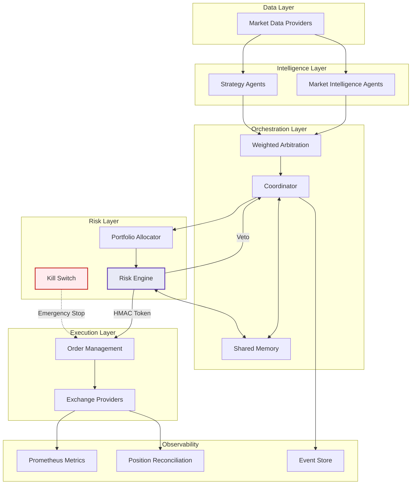

<p align="center">
  
</p>

<h1 align="center">Autonomous Investment Swarm</h1>

<p align="center">
  <strong>Risk-gated autonomous trading with multi-agent orchestration</strong>
</p>

<p align="center">
  <a href="https://github.com/kmshihab7878/Financial-Intelligence-Department-FID/actions/workflows/ci.yml"></a>
  <a href="https://kmshihab7878.github.io/Financial-Intelligence-Department-FID/"></a>
  <a href="https://codecov.io/gh/kmshihab7878/Financial-Intelligence-Department-FID"></a>
  <a href="https://www.python.org/downloads/"></a>
  <a href="https://docs.astral.sh/ruff/"></a>
  <a href="http://mypy-lang.org/"></a>
  <a href="LICENSE"></a>
</p>

<p align="center">
  <a href="https://kmshihab7878.github.io/Financial-Intelligence-Department-FID/">Documentation</a> &middot;
  <a href="https://kmshihab7878.github.io/Financial-Intelligence-Department-FID/getting-started/quickstart/">Quick Start</a> &middot;
  <a href="https://kmshihab7878.github.io/Financial-Intelligence-Department-FID/architecture/overview/">Architecture</a> &middot;
  <a href="https://kmshihab7878.github.io/Financial-Intelligence-Department-FID/reference/api/">API Reference</a> &middot;
  <a href="ROADMAP.md">Roadmap</a>
</p>

---

> **Warning**: This software is experimental and intended for research and educational purposes. Trading involves substantial risk of loss. Never deploy with funds you cannot afford to lose.

## Why AIS?

Most trading bots execute a single strategy with basic stop-losses. AIS is an **autonomous investment operating system** — a governed, multi-agent pipeline where every trade passes through cryptographic risk validation before execution.

<table>
<tr>
<td width="50%">

### Risk-Gated Execution
Every order requires an HMAC-signed approval token from the risk engine. No token, no trade. The system **fails closed**, not open.

### Multi-Agent Orchestration
Strategy agents compete to generate signals. Weighted arbitration selects the best signal by confidence, return, and liquidity — preventing conflicting positions.

### Mandate Governance
Strategies operate within explicit mandates that cap allocation, restrict instruments, and enforce position limits.

</td>
<td width="50%">

### Three Execution Modes
Paper (simulated), Shadow (read-only), Live (gated). **Same pipeline in all modes** — what you test is what you deploy.

### Multi-Exchange
Unified abstraction across Aster DEX, Binance, Coinbase, Bybit, and Interactive Brokers with config-driven symbol routing.

### Full Observability
Prometheus metrics, Grafana dashboards, Alertmanager alerts, structured JSON logging, position reconciliation, and append-only audit trail.

</td>
</tr>
</table>

## Architecture



<details>
<summary><strong>Project Structure</strong></summary>

```
src/aiswarm/
├── agents/         # Strategy agents (momentum, funding rate)
├── api/            # FastAPI control plane (auth, routes, Prometheus)
├── backtest/       # Backtesting engine, adapters, data loader
├── bootstrap.py    # Config → component graph wiring
├── data/           # EventStore (SQLite), market data providers
├── exchange/       # Multi-exchange abstraction layer
│   └── providers/  # Aster, Binance, Coinbase, Bybit, Interactive Brokers
├── execution/      # Order executor, order store, fill tracker
├── integrations/   # TradingView webhooks, portfolio trackers, tax export
├── loop/           # Autonomous trading loop (60s cycle)
├── mandates/       # Governance: mandate registry, validator
├── monitoring/     # Prometheus metrics, alerts, reconciliation
├── orchestration/  # Coordinator, arbitration, shared memory
├── portfolio/      # Allocator, exposure manager
├── quant/          # Kelly criterion, risk metrics, drift detection
├── resilience/     # Circuit breaker, rate limiter, graceful shutdown
├── risk/           # Risk engine, kill switch, drawdown, leverage checks
├── session/        # Session lifecycle management
├── types/          # Pydantic domain models (Signal, Order, Portfolio)
└── utils/          # Secrets provider, logging, time utilities
```

</details>

## Quick Start

```bash
# Install
git clone https://github.com/kmshihab7878/Financial-Intelligence-Department-FID.git
cd Financial-Intelligence-Department-FID
pip install -e ".[dev]"

# Configure (minimum: set HMAC secret)
cp .env.example .env
export AIS_RISK_HMAC_SECRET=$(python -c "import secrets; print(secrets.token_urlsafe(32))")

# Run paper trading
python -m aiswarm --mode paper
```

**Docker:**

```bash
cp .env.example .env
# Edit .env with required values
docker compose up --build
# API: http://localhost:8000 | Prometheus: http://localhost:9090 | Grafana: http://localhost:3000
```

See the [full quickstart guide](https://kmshihab7878.github.io/Financial-Intelligence-Department-FID/getting-started/quickstart/) for more.

## Supported Exchanges

| Exchange | Spot | Futures | Options | Symbol Format |
|----------|:----:|:-------:|:-------:|---------------|
| Aster DEX | x | x | | `BTCUSDT` |
| Binance | x | x | | `BTCUSDT` |
| Coinbase | x | | | `BTC-USD` |
| Bybit | x | x | x | `BTCUSDT` |
| Interactive Brokers | x | x | x | `AAPL`, `BTCUSD` |

Exchange routing is config-driven via `config/exchanges.yaml`. See [Multi-Exchange Setup](https://kmshihab7878.github.io/Financial-Intelligence-Department-FID/guides/multi-exchange/).

## How It Differs

| | AIS | Typical Trading Bot |
|---|---|---|
| **Risk validation** | HMAC-signed tokens, fail-closed | Basic stop-loss |
| **Architecture** | Multi-agent weighted arbitration | Single strategy |
| **Governance** | Mandate system with allocation caps | None |
| **Execution safety** | 3 modes, same pipeline | Live-only |
| **Observability** | Prometheus + Grafana + reconciliation | Log files |
| **Exchange support** | 5 exchanges, unified abstraction | 1-2 hardcoded |
| **Audit trail** | Append-only event store + decision log | None |
| **Type safety** | mypy strict, Pydantic v2 frozen models | Partial or none |

## Example Output

Paper trading loop (structured JSON):

```json
{"event": "session_started", "mode": "paper", "strategies": ["momentum_ma_crossover", "funding_rate_contrarian"]}
{"event": "cycle_start", "cycle": 1, "timestamp": "2025-01-15T10:00:00Z"}
{"event": "signal_generated", "agent": "momentum", "symbol": "BTCUSDT", "direction": 1, "confidence": 0.72}
{"event": "risk_approved", "symbol": "BTCUSDT", "size": 0.001, "token": "hmac:a3f2..."}
{"event": "order_submitted", "symbol": "BTCUSDT", "side": "BUY", "qty": 0.001, "mode": "paper"}
{"event": "cycle_end", "cycle": 1, "duration_ms": 245}
```

## Development

```bash
# Tests with coverage
pytest tests/unit/ -v --cov=src/aiswarm --cov-fail-under=83

# Lint + format
ruff check src/ tests/unit/
ruff format --check src/ tests/unit/

# Type check
mypy src/aiswarm/ --ignore-missing-imports

# All quality checks
make lint && make typecheck && make test-cov
```

## Documentation

Full documentation is available at **[kmshihab7878.github.io/Financial-Intelligence-Department-FID](https://kmshihab7878.github.io/Financial-Intelligence-Department-FID/)**, including:

- [Getting Started](https://kmshihab7878.github.io/Financial-Intelligence-Department-FID/getting-started/installation/) — Installation, quickstart, configuration
- [Architecture](https://kmshihab7878.github.io/Financial-Intelligence-Department-FID/architecture/overview/) — System design, risk engine, exchange layer
- [Strategy Development](https://kmshihab7878.github.io/Financial-Intelligence-Department-FID/guides/strategy-development/) — Build custom trading agents
- [API Reference](https://kmshihab7878.github.io/Financial-Intelligence-Department-FID/reference/api/) — Control plane endpoints
- [Deployment](https://kmshihab7878.github.io/Financial-Intelligence-Department-FID/guides/deployment/) — Docker, monitoring, production

## Contributing

See [CONTRIBUTING.md](CONTRIBUTING.md) for development setup and PR requirements.

## Security

If you discover a security vulnerability, please report it responsibly. See [SECURITY.md](SECURITY.md).

## Roadmap

See [ROADMAP.md](ROADMAP.md) for planned milestones and the project direction.

## License

Apache License 2.0. See [LICENSE](LICENSE).
