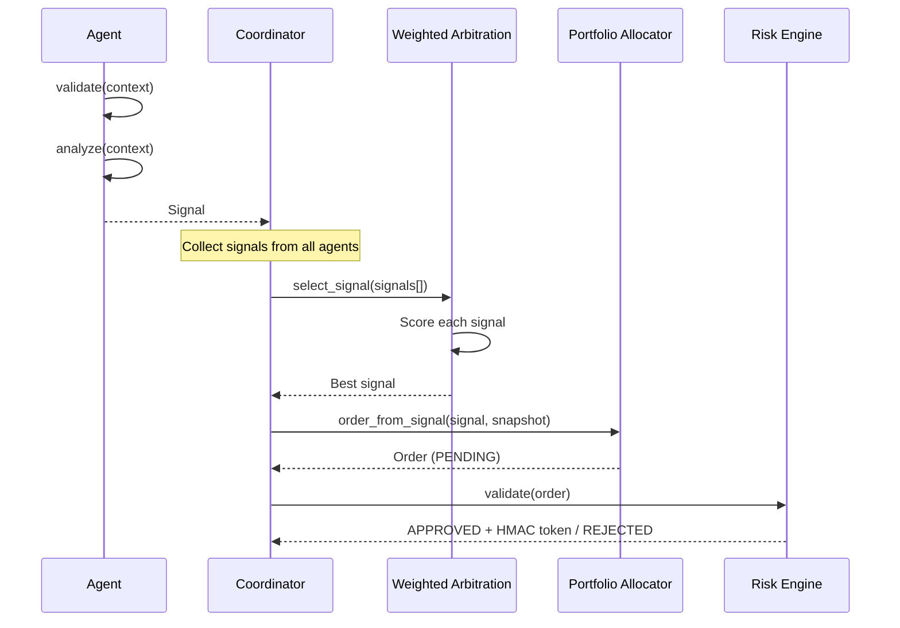

# Agent System

Agents are the intelligence layer of AIS. Each agent consumes market data, produces `Signal` objects, and participates in a governed orchestration pipeline.

## Base Interface

All agents extend `aiswarm.agents.base.Agent`:

```python
class Agent(ABC):
    def __init__(self, agent_id: str, cluster: str) -> None: ...

    @abstractmethod
    def analyze(self, context: dict[str, Any]) -> dict[str, Any]: ...

    @abstractmethod
    def propose(self, context: dict[str, Any]) -> dict[str, Any]: ...

    @abstractmethod
    def validate(self, context: dict[str, Any]) -> bool: ...
```

| Method | Purpose |
|--------|---------|
| `analyze(context)` | Read and interpret market data, generate signals |
| `propose(context)` | Generate an actionable signal (typically calls `analyze`) |
| `validate(context)` | Pre-check whether the agent has sufficient data |

## Agent Clusters

Agents are organized into functional clusters:

| Cluster | Directory | Purpose |
|---------|-----------|---------|
| `strategy` | `agents/strategy/` | Signal generation from market data |
| `market_intelligence` | `agents/market_intelligence/` | Market structure analysis |

## Implemented Agents

### MomentumAgent

**Location**: `agents/strategy/momentum_agent.py`
**Strategy**: `momentum_ma_crossover`

Dual SMA crossover with trend consistency scoring:

- Computes fast (20-period) and slow (50-period) simple moving averages
- **Long** when fast MA > slow MA and price > fast MA
- **Short** when fast MA < slow MA and price < fast MA
- Confidence scales with MA spread and trend consistency
- Horizon: 4 hours

### FundingRateAgent

**Location**: `agents/market_intelligence/funding_rate_agent.py`
**Strategy**: `funding_rate_contrarian`

Contrarian signals from extreme funding rates:

- Monitors funding rate data from the exchange
- Detects extreme rates (>0.1% per 8h) as contrarian entry signals
- **Long** when funding is extremely negative (shorts are overcrowded)
- **Short** when funding is extremely positive (longs are overcrowded)

## Signal Lifecycle



## Signal Schema

```python
Signal(
    signal_id: str,          # Unique identifier
    agent_id: str,           # Originating agent
    symbol: str,             # Trading instrument
    strategy: str,           # Strategy name (must match mandate)
    thesis: str,             # Human-readable rationale (min 5 chars)
    direction: int,          # -1 (short), 0 (neutral), 1 (long)
    confidence: float,       # 0.0 to 1.0
    expected_return: float,  # Expected return over horizon
    horizon_minutes: int,    # Signal validity window (> 0)
    liquidity_score: float,  # 0.0 to 1.0
    regime: MarketRegime,    # risk_on | risk_off | transition | stressed
    created_at: datetime,
    reference_price: float,  # Price at signal generation time
)
```

## Arbitration

`WeightedArbitration` selects the best signal from competing agents:

```
score = agent_weight * confidence * max(expected_return, 0) * max(liquidity_score, 0.01)
```

Winner-take-all: only the highest-scoring signal proceeds to allocation. This prevents conflicting positions from different agents.

## Adding a New Agent

See the [Strategy Development Guide](../guides/strategy-development.md) for a step-by-step tutorial. Summary:

1. Create a module in the appropriate cluster directory
2. Extend `Agent`, implement `analyze()`, `propose()`, `validate()`
3. `propose()` must return a `Signal` with all required fields
4. Register the agent with the `Coordinator` at startup
5. Set the agent weight in arbitration config
6. Add a corresponding mandate in `config/mandates.yaml`
