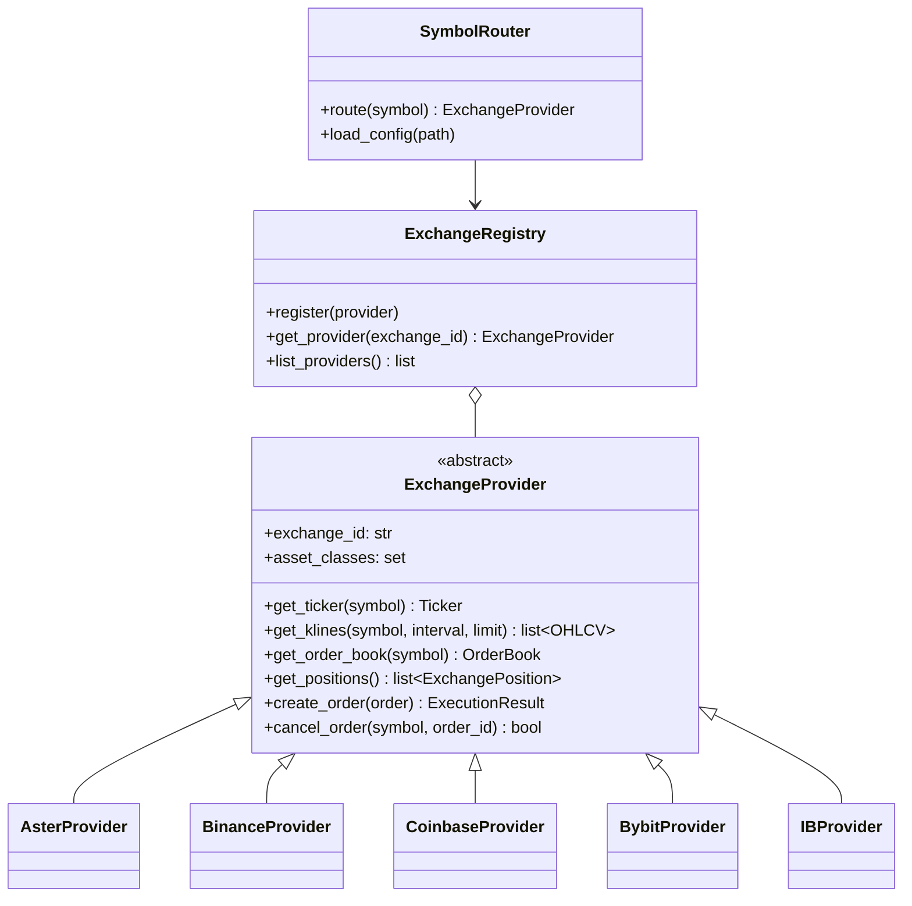

# Exchange Layer

AIS supports multiple exchanges through a unified abstraction layer. All exchange communication goes through `ExchangeProvider`.

## Architecture



## Components

### ExchangeProvider (ABC)

Base class for all exchange implementations. Defines the interface for market data and order execution.

Key responsibilities:
- Encapsulates all exchange-specific tool names (e.g., MCP tool references)
- Provides canonical type conversion from exchange-specific formats
- Handles paper/shadow/live mode differences

### ExchangeRegistry

Manages multiple provider instances. Allows lookup by exchange ID.

### SymbolRouter

Maps symbols to exchanges based on `config/exchanges.yaml`. When the coordinator needs to trade `BTCUSDT`, the router determines which exchange handles it.

## Supported Exchanges

| Exchange | ID | Asset Classes | Symbol Format | Gateway |
|----------|----|---------------|---------------|---------|
| Aster DEX | `aster` | SPOT, FUTURES | `BTCUSDT` | MCP |
| Binance | `binance` | SPOT, FUTURES | `BTCUSDT` | MCP |
| Coinbase | `coinbase` | SPOT | `BTC-USD` | MCP |
| Bybit | `bybit` | SPOT, FUTURES, OPTIONS | `BTCUSDT` | MCP |
| Interactive Brokers | `ib` | STOCKS, OPTIONS, FUTURES, FOREX | `AAPL` | MCP |

## Configuration

```yaml
# config/exchanges.yaml
exchanges:
  aster:
    enabled: true
    asset_classes: [spot, futures]
    symbols: [BTCUSDT, ETHUSDT]
    mcp_url: ${AIS_MCP_SERVER_URL}

  binance:
    enabled: true
    asset_classes: [spot, futures]
    symbols: [SOLUSDT, AVAXUSDT]
    mcp_url: ${AIS_BINANCE_MCP_URL}
    api_key: ${BINANCE_API_KEY}
    api_secret: ${BINANCE_API_SECRET}

  coinbase:
    enabled: false
    asset_classes: [spot]
    symbols: [BTC-USD]
```

## Provider Selection

Providers are automatically selected based on execution mode:

- **Paper**: `Provider(MockMCPGateway())` — simulated fills, no exchange connection
- **Shadow/Live**: `Provider(HTTPMCPGateway(url))` — real exchange via MCP gateway

Override via `bootstrap_from_config(gateway=...)`.

## Adding a New Exchange

1. Create a new provider in `exchange/providers/`
2. Extend `ExchangeProvider`, implement all abstract methods
3. Map exchange-specific data formats to canonical types (`OHLCV`, `Ticker`, etc.)
4. Register the provider in `exchange/registry.py`
5. Add configuration in `config/exchanges.yaml`
6. Add environment variables for credentials
