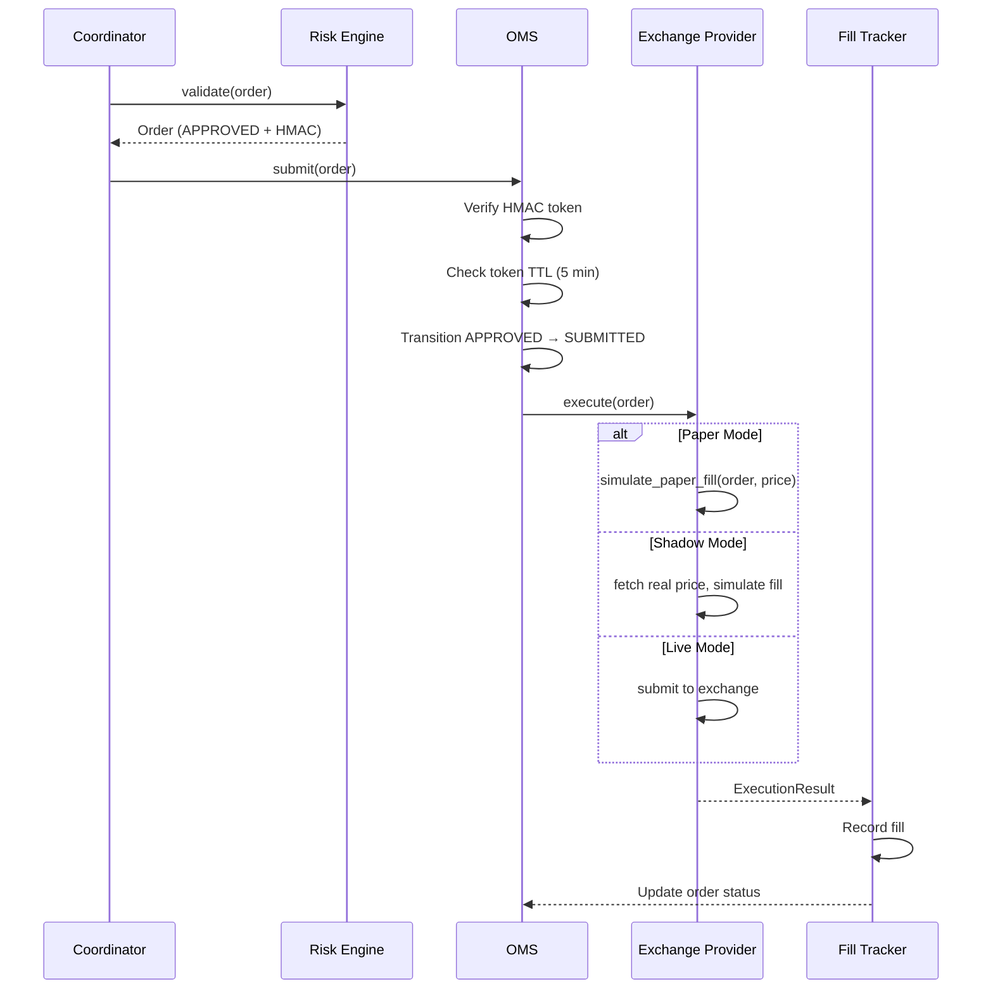
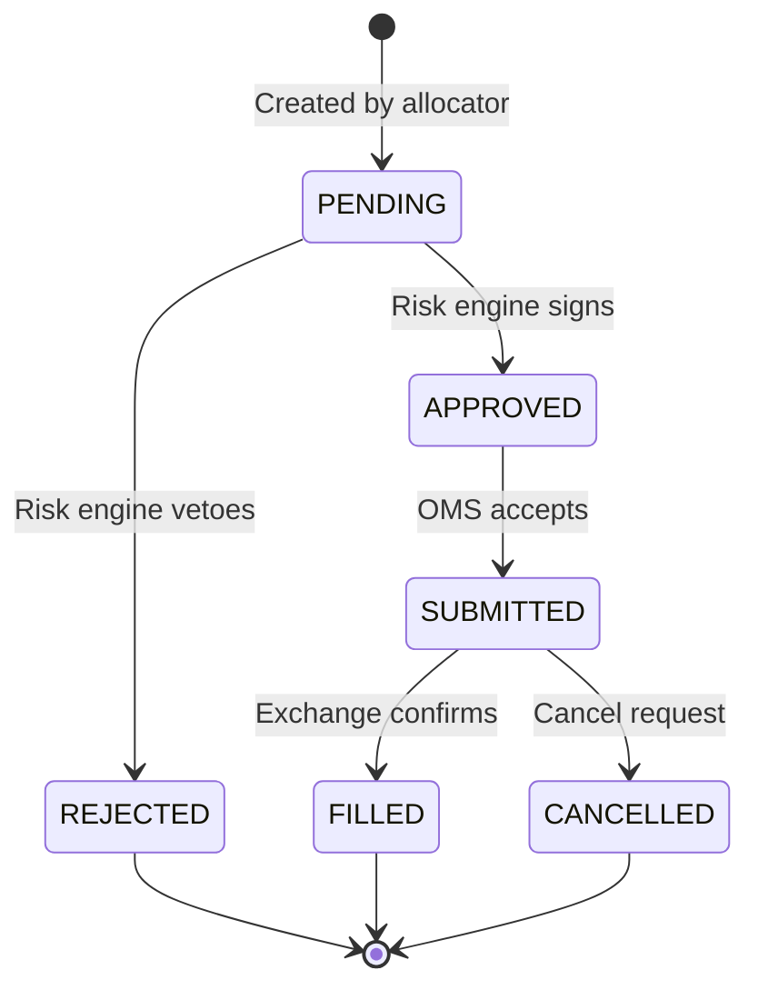

# Execution Engine

The execution engine manages order lifecycle from risk-approved intent to exchange fill.

## Order Flow

## Order Management System (OMS)

The OMS is the final gate before order submission. It performs:

1. **Token presence check** — Order must have `risk_approval_token`
2. **HMAC verification** — Token signature must match using `AIS_RISK_HMAC_SECRET`
3. **TTL check** — Token must not be older than 5 minutes
4. **Status transition** — `APPROVED` to `SUBMITTED`

Orders without valid tokens are rejected.

## Execution Modes

| Mode | Exchange Connection | Order Submission | Use Case |
|------|-------------------|------------------|----------|
| `paper` | None | Simulated fills | Development, strategy testing |
| `shadow` | Read-only | Simulated against real prices | Pre-live validation |
| `live` | Full access | Real orders | Production |

All modes share the same execution pipeline. The difference is only at the exchange provider level.

## Order Status Lifecycle

## Safety Gates

1. **Risk token** — HMAC-SHA256 signed, 5-minute TTL, constant-time comparison
2. **Live mode env var** — `AIS_ENABLE_LIVE_TRADING=true` must be explicitly set
3. **Account ID** — `ASTER_ACCOUNT_ID` required for live mode
4. **Leverage enforcement** — Must call `set_leverage` before first order
5. **Margin mode** — Must call `set_margin_mode` (ISOLATED recommended)

## Exchange Provider

Orders are executed through the `ExchangeProvider` abstraction:

- `prepare_futures_order(order)` — Futures order parameters
- `prepare_spot_order(order)` — Spot order parameters
- `prepare_cancel_order(symbol, order_id)` — Single cancel
- `prepare_cancel_all(symbol)` — Cancel all for a symbol
- `prepare_emergency_cancel_all(symbols)` — Kill switch cancel
- `simulate_paper_fill(order, price)` — Simulated fill for paper mode

See [Exchange Layer](exchange-layer.md) for multi-exchange details.
