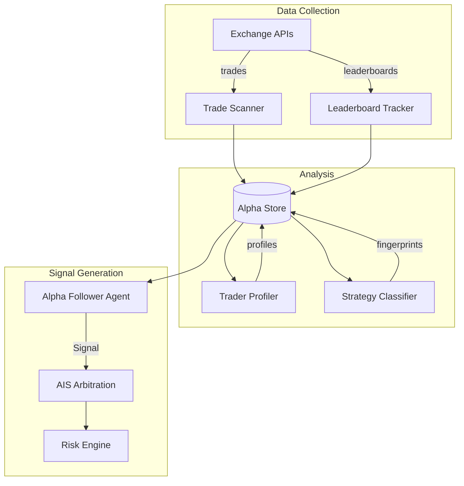
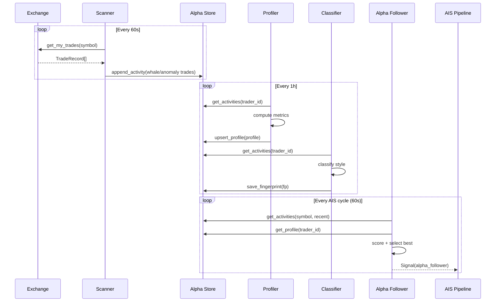

# Alpha Intelligence Engine

The Alpha Intelligence Engine scans trades across connected exchanges, identifies top-performing traders, reverse-engineers their strategies, and generates signals from their behavior.

## Architecture



## Components

### Trade Scanner

Polls connected exchanges for notable trades:

- **Whale detection** — flags trades above a configurable notional threshold (default: $50,000)
- **Volume anomalies** — detects trades that are 3x+ the recent average for a symbol
- **Deduplication** — tracks seen trade IDs to avoid double-counting

### Leaderboard Tracker

Monitors copy-trading leaderboards from Binance, Bybit, and other exchanges:

- **Periodic snapshots** — captures leaderboard state every hour
- **Rank history** — tracks how traders move up/down over time
- **Consistency detection** — identifies traders who maintain top positions across multiple snapshots

### Trader Profiler

Builds statistical profiles from observed trade data:

| Metric | Description |
|--------|-------------|
| Win rate | Fraction of trades with positive P&L |
| Sharpe ratio | Risk-adjusted return (annualized) |
| Sortino ratio | Downside-risk-adjusted return |
| Max drawdown | Largest peak-to-trough decline |
| Profit factor | Gross profit / gross loss |
| Consistency score | Stability of win rate over time (0-1) |
| Avg holding period | Mean trade duration in minutes |
| Trade frequency | Trades per day |
| Preferred symbols | Most traded instruments |

Traders are classified into tiers:

| Tier | Criteria |
|------|----------|
| Elite | Top 1% — sustained edge, high Sharpe, 60+ composite score |
| Strong | Top 5% — consistently profitable, 45+ score |
| Notable | Top 15% — above average, 30+ score |
| Average | Median performers |
| Weak | Below average or insufficient data |

### Strategy Classifier

Reverse-engineers trading styles from trade patterns:

| Style | Detection Criteria |
|-------|-------------------|
| Scalper | Average holding < 15 minutes |
| Momentum | Intraday holding, moderate win rate |
| Mean Reversion | High win rate (>65%), low return variance |
| Breakout | Lower win rate (<50%), large winner/loser ratio (>2x) |
| Swing | Holding 8h-7d |
| Trend Following | Holding > 7 days |
| Contrarian | Low win rate but very large winners (>3x losers) |

Produces a `StrategyFingerprint` that captures entry timing, exit patterns, sizing behavior, and market condition preferences.

### Alpha Follower Agent

Generates AIS Signals when top-tier traders open positions:

1. Queries AlphaStore for recent activity on the target symbol
2. Filters for trades from traders meeting the minimum tier requirement
3. Scores each activity using: `base_confidence(tier) + consistency_bonus + win_rate_adj + sharpe_adj`
4. Applies recency decay (fresher = higher confidence)
5. Emits the strongest signal through the standard AIS pipeline

The agent:
- Extends the standard `Agent` ABC
- Produces standard `Signal` objects
- Is subject to mandate governance and risk validation
- Participates in weighted arbitration alongside other strategy agents

## Configuration

```yaml
# config/intelligence.yaml
intelligence:
  enabled: true
  scanner:
    whale_threshold_usd: 50000
    volume_spike_multiplier: 3.0
  leaderboard:
    refresh_interval_seconds: 3600
    max_rank_to_track: 100
  agent:
    min_tier: notable
    max_activity_age_seconds: 3600
    agent_weight: 0.6
```

## Data Flow


