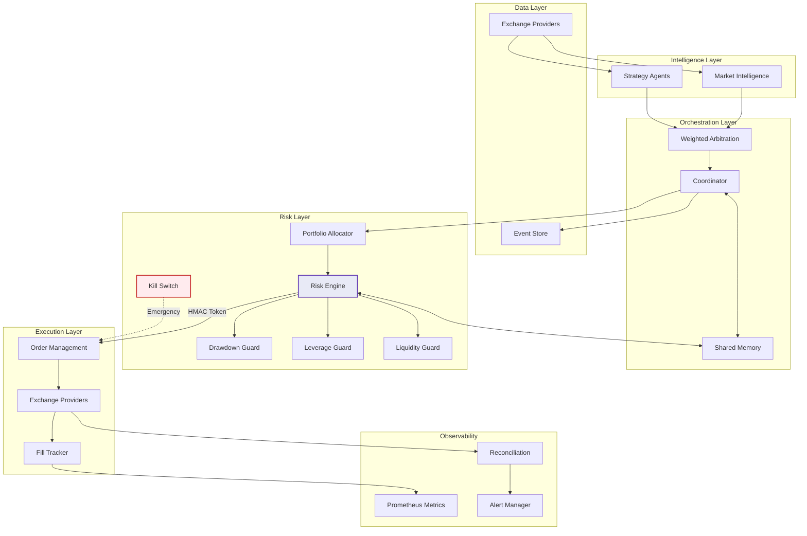
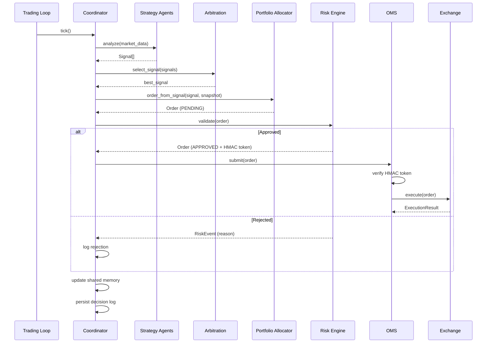

# Architecture Overview

AIS is built around a simple principle: **no order executes without cryptographic risk approval**. The architecture enforces this through a layered pipeline where each component has a single responsibility.

## System Architecture



## Trading Cycle

Every 60 seconds, the coordinator executes one complete cycle:



## Component Responsibilities

### Data Layer
- **Exchange Providers** — Fetch market data (klines, ticker, order book, funding rates) from exchanges via MCP
- **Event Store** — Append-only SQLite store for decisions, orders, risk events, and fills

### Intelligence Layer
- **Strategy Agents** — Generate `Signal` objects from market data. Each agent implements `analyze()`, `propose()`, and `validate()`
- **Market Intelligence** — Specialized agents for market structure analysis (funding rates, regime detection)

### Orchestration Layer
- **Coordinator** — Runs the trading cycle, routes data between components
- **Weighted Arbitration** — Selects the best signal from competing agents using `weight * confidence * return * liquidity`
- **Shared Memory** — Maintains live portfolio state (NAV, drawdown, leverage, positions)

### Risk Layer
- **Portfolio Allocator** — Converts signals to orders with position sizing (target weight * confidence)
- **Risk Engine** — Validates orders against all guards, signs approved orders with HMAC tokens
- **Kill Switch** — Emergency stop triggered by daily loss or manual activation
- **Guards** — Drawdown, leverage, liquidity, and exposure checks

### Execution Layer
- **OMS** — Verifies HMAC tokens, transitions order status, routes to exchange
- **Fill Tracker** — Records execution results and updates order status
- **Exchange Providers** — Submit orders to exchanges (paper/shadow/live)

### Observability
- **Prometheus Metrics** — P&L, exposure, drawdown, agent latency, order rates
- **Reconciliation** — Compares internal state against exchange positions
- **Alertmanager** — Dispatches alerts for risk events and anomalies

## Design Principles

1. **Fail closed** — Missing secrets, invalid tokens, or unreachable services cause the system to stop, not proceed with defaults
2. **HMAC-signed risk approval** — Cryptographic proof that the risk engine approved each order
3. **Append-only audit** — Every decision, order, and risk event is persisted and immutable
4. **Mode parity** — Paper, shadow, and live modes share the same code path
5. **Config-driven routing** — Exchange and symbol routing is declarative, not hardcoded

## Directory Structure

```
src/aiswarm/
├── agents/             # Strategy agents
│   ├── base.py             # Agent ABC
│   ├── market_intelligence/ # Market structure agents
│   └── strategy/           # Signal generation agents
├── api/                # FastAPI control plane
├── backtest/           # Backtesting engine
├── bootstrap.py        # Config → component graph
├── data/               # Event store, data providers
├── exchange/           # Multi-exchange abstraction
│   ├── provider.py         # ExchangeProvider ABC
│   ├── registry.py         # ExchangeRegistry
│   ├── symbols.py          # SymbolRouter
│   └── providers/          # Exchange implementations
├── execution/          # Order management, fill tracking
├── integrations/       # TradingView, portfolio trackers, tax
├── loop/               # Trading loop (60s cycle)
├── mandates/           # Governance system
├── monitoring/         # Metrics, alerts, reconciliation
├── orchestration/      # Coordinator, arbitration, memory
├── portfolio/          # Allocator, exposure manager
├── quant/              # Kelly, risk metrics, drift detection
├── resilience/         # Circuit breaker, rate limiter
├── risk/               # Risk engine, kill switch, guards
├── session/            # Session lifecycle
├── types/              # Pydantic domain models
└── utils/              # Logging, secrets, time
```
