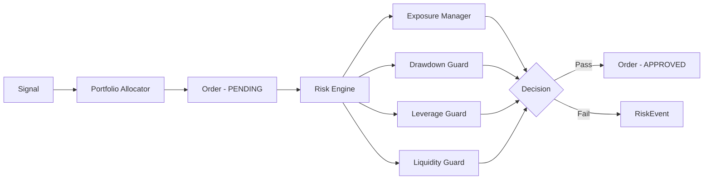

# Portfolio Engine

The portfolio engine converts signals into sized orders and manages portfolio-level exposure.

## Components

### Portfolio Allocator

Converts signals into orders using target weight sizing:

```python
PortfolioAllocator(target_weight=0.02)
    .order_from_signal(signal, snapshot) -> Order
```

**Sizing formula**:

```
notional = max(nav * target_weight * confidence, 100.0)
quantity = notional / price_proxy
```

- `target_weight`: Fraction of NAV per position (default 2%)
- `confidence`: Signal confidence (0.0-1.0) scales position down
- Minimum notional of 100.0 to avoid dust orders
- Direction: `signal.direction >= 0` maps to BUY, else SELL

### Exposure Manager

Validates portfolio-level exposure limits:

- **Max position weight** — Single position cannot exceed X% of NAV
- **Max gross exposure** — Sum of all position absolute values cannot exceed X% of NAV

### Shared Memory

Maintains live portfolio state for the coordinator:

| Field | Description |
|-------|-------------|
| `latest_snapshot` | Current `PortfolioSnapshot` |
| `latest_pnl` | Daily P&L fraction |
| `rolling_drawdown` | Peak-to-trough drawdown |
| `current_leverage` | Gross exposure / NAV |
| `peak_nav` | Highest NAV observed |

`update_snapshot(snapshot)` automatically derives drawdown and leverage.

## Data Flow



## Portfolio Types

```python
Position(
    symbol: str,
    quantity: float,
    avg_price: float,
    market_price: float,
    strategy: str,
)
# Computed: market_value = quantity * market_price

PortfolioSnapshot(
    timestamp: datetime,
    nav: float,
    cash: float,
    gross_exposure: float,
    net_exposure: float,
    positions: list[Position],
)
```

## State Persistence

Portfolio checkpoints are saved to the EventStore for recovery after restart:

```python
store.save_portfolio_checkpoint(snapshot_dict)
snapshot = store.load_portfolio_checkpoint()
```
