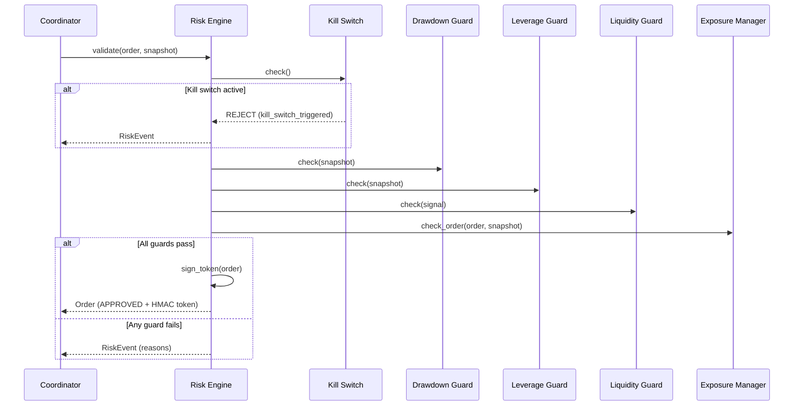

# Risk Engine

The risk engine is the central safety gate of AIS. Every order must pass through risk validation and receive an HMAC-signed approval token before execution.

## Validation Pipeline



## HMAC Token

The risk engine signs approved orders with HMAC-SHA256:

```
token = HMAC-SHA256(
    key = AIS_RISK_HMAC_SECRET,
    message = f"{order_id}:{symbol}:{side}:{quantity}:{timestamp}"
)
```

The token is:
- Attached to the `Order.risk_approval_token` field
- Verified by the OMS before accepting the order
- Verified by the executor before submitting to the exchange
- Valid for 5 minutes (TTL enforced at verification)
- Compared using constant-time comparison (timing-attack resistant)

### Key Rotation

Zero-downtime key rotation is supported:

1. Set `AIS_RISK_HMAC_SECRET_PREVIOUS` to the current secret
2. Set `AIS_RISK_HMAC_SECRET` to the new secret
3. Set `AIS_RISK_HMAC_KEY_ID` to identify the new key (e.g., `v2`)
4. The verifier checks both keys during the transition period
5. Remove `AIS_RISK_HMAC_SECRET_PREVIOUS` after all in-flight tokens expire

## Risk Guards

### Kill Switch

Triggers an emergency stop when:
- Daily cumulative loss exceeds threshold
- Manual activation via API (`POST /control/kill-switch`)

When triggered:
- All pending orders are cancelled
- No new orders are accepted
- System state transitions to `KILLED`
- Manual restart required to resume

### Drawdown Guard

Rejects orders when rolling peak-to-trough drawdown exceeds the configured maximum.

```
drawdown = (peak_nav - current_nav) / peak_nav
REJECT if drawdown >= max_drawdown
```

### Leverage Guard

Rejects orders when portfolio leverage exceeds the configured ceiling.

```
leverage = gross_exposure / nav
REJECT if leverage > max_leverage
```

### Liquidity Guard

Rejects signals with insufficient liquidity score.

```
REJECT if signal.liquidity_score < min_liquidity_score
```

### Exposure Manager

Validates portfolio-level exposure constraints:
- **Max position weight**: Single position cannot exceed X% of NAV
- **Max gross exposure**: Sum of all position absolute values cannot exceed X% of NAV

## Risk Events

Every risk decision produces a `RiskEvent`:

```python
RiskEvent(
    event_id: str,
    severity: Severity,    # INFO, WARNING, CRITICAL
    rule: str,             # Guard that triggered
    message: str,          # Human-readable description
    symbol: str | None,
    strategy: str | None,
)
```

Severity levels:
- **INFO** — Order approved, normal operation
- **WARNING** — Order rejected by a guard, system continues
- **CRITICAL** — Kill switch triggered, system halted

## Configuration

```yaml
# config/risk.yaml
risk:
  max_drawdown: 0.05          # 5% rolling drawdown limit
  max_leverage: 3.0           # 3x leverage ceiling
  max_position_weight: 0.10   # 10% NAV per position
  max_gross_exposure: 1.5     # 150% gross exposure
  min_liquidity_score: 0.3    # Minimum liquidity
  kill_switch_loss: 0.03      # 3% daily loss triggers kill
```
