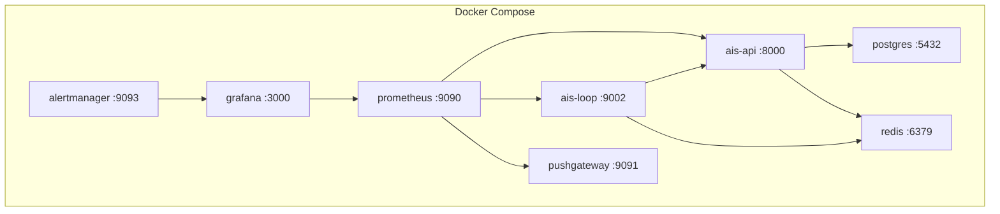

# Deployment

## Docker Compose (Recommended)

The full stack runs with Docker Compose:

```bash
# Configure environment
cp .env.example .env
# Edit .env with required values

# Start all services
docker compose up --build -d
```

### Services

| Service | Port | Purpose |
|---------|------|---------|
| `ais-api` | 8000 | FastAPI control plane |
| `ais-loop` | 9002 | Trading loop (metrics port) |
| `postgres` | 5432 | Database (localhost only) |
| `redis` | 6379 | Control state (localhost only) |
| `prometheus` | 9090 | Metrics collection |
| `grafana` | 3000 | Dashboard visualization |
| `alertmanager` | 9093 | Alert routing |
| `pushgateway` | 9091 | Backtest metric ingestion |

### Health Checks

All services include health checks:

- **ais-api**: `curl http://localhost:8000/health`
- **ais-loop**: Heartbeat file check (120s stale threshold)
- **postgres**: `pg_isready`
- **redis**: `redis-cli ping`

### Logs

```bash
# All services
docker compose logs -f

# Specific service
docker compose logs -f ais-loop

# Last 100 lines
docker compose logs --tail 100 ais-api
```

## Service Architecture



## Environment Configuration

### Required Variables

```bash
# Core
AIS_RISK_HMAC_SECRET=<generate-a-secret>
AIS_EXECUTION_MODE=paper

# Docker Compose
AIS_DB_PASSWORD=<database-password>
GF_ADMIN_PASSWORD=<grafana-admin-password>
```

### Production Considerations

1. **Never run live mode without thorough paper testing**
2. **Set strong, unique secrets** for HMAC, API key, and database passwords
3. **Bind database and Redis to localhost** (already configured in docker-compose.yml)
4. **Monitor resource usage** — the trading loop runs every 60 seconds
5. **Set up alerting** — Configure Alertmanager to notify on risk events
6. **Back up the event store** — Contains the audit trail

## Scaling

The current architecture runs as two processes (API + loop) sharing state through Redis. For scaling:

- **API**: Can run multiple instances behind a load balancer
- **Loop**: Single instance only (leader election planned for v1.5)
- **Database**: Standard PostgreSQL scaling applies
- **Monitoring**: Prometheus handles many targets; Grafana has no state
