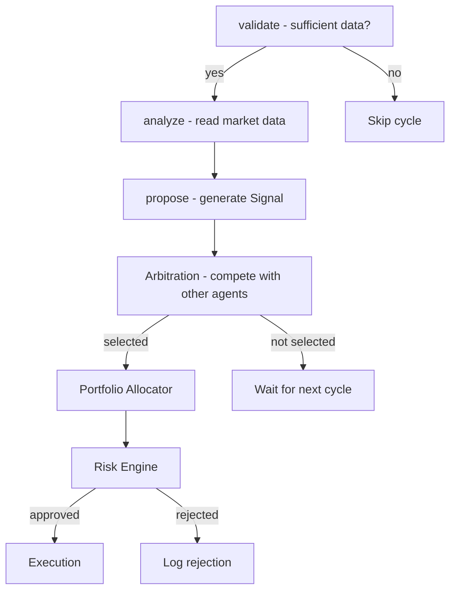

# Strategy Development Guide

This guide walks you through building a custom strategy agent for AIS.

## Agent Interface

Every agent extends `aiswarm.agents.base.Agent`:

```python
from aiswarm.agents.base import Agent

class MyAgent(Agent):
    def __init__(self) -> None:
        super().__init__(agent_id="my_agent", cluster="strategy")

    def analyze(self, context: dict[str, Any]) -> dict[str, Any]:
        """Read market data and generate a signal."""
        ...

    def propose(self, context: dict[str, Any]) -> dict[str, Any]:
        """Propose an action (typically calls analyze)."""
        return self.analyze(context)

    def validate(self, context: dict[str, Any]) -> bool:
        """Check if sufficient data is available."""
        ...
```

## Step-by-Step: Bollinger Band Mean Reversion

### 1. Create the Agent File

Create `src/aiswarm/agents/strategy/mean_reversion_agent.py`:

```python
from __future__ import annotations

import math
from typing import Any

from aiswarm.agents.base import Agent
from aiswarm.data.providers.aster import AsterDataProvider, OHLCV
from aiswarm.types.market import MarketRegime, Signal
from aiswarm.utils.ids import new_id
from aiswarm.utils.logging import get_logger
from aiswarm.utils.time import utc_now

logger = get_logger(__name__)


def _bollinger_bands(
    candles: list[OHLCV], period: int = 20, num_std: float = 2.0
) -> tuple[float, float, float] | None:
    """Compute Bollinger Bands (middle, upper, lower)."""
    if len(candles) < period:
        return None
    closes = [c.close for c in candles[-period:]]
    middle = sum(closes) / len(closes)
    variance = sum((c - middle) ** 2 for c in closes) / len(closes)
    std = math.sqrt(variance)
    return middle, middle + num_std * std, middle - num_std * std


class MeanReversionAgent(Agent):
    def __init__(
        self,
        agent_id: str = "mean_reversion_agent",
        bb_period: int = 20,
        bb_std: float = 2.0,
    ) -> None:
        super().__init__(agent_id=agent_id, cluster="strategy")
        self.bb_period = bb_period
        self.bb_std = bb_std
        self.provider = AsterDataProvider()

    def analyze(self, context: dict[str, Any]) -> dict[str, Any]:
        raw_klines = context.get("klines_data")
        symbol = context.get("symbol", "BTCUSDT")

        if raw_klines is None:
            return {"signal": None, "reason": "no_data"}

        candles = self.provider.parse_klines(raw_klines, symbol)
        bands = _bollinger_bands(candles, self.bb_period, self.bb_std)
        if bands is None:
            return {"signal": None, "reason": "insufficient_data"}

        middle, upper, lower = bands
        price = candles[-1].close

        if price < lower:
            direction = 1   # Long: oversold
        elif price > upper:
            direction = -1  # Short: overbought
        else:
            return {"signal": None, "reason": "price_within_bands"}

        confidence = min(0.85, 0.45 + abs(price - middle) / (upper - lower) * 0.4)

        signal = Signal(
            signal_id=new_id("sig"),
            agent_id=self.agent_id,
            symbol=symbol,
            strategy="mean_reversion_bb",
            thesis=f"Mean reversion: price={price:.2f}, bands=[{lower:.2f}, {upper:.2f}]",
            direction=direction,
            confidence=confidence,
            expected_return=abs(price - middle) / price * 0.5,
            horizon_minutes=120,
            liquidity_score=0.8,
            regime=MarketRegime.RISK_OFF,
            created_at=utc_now(),
            reference_price=price,
        )
        return {"signal": signal}

    def propose(self, context: dict[str, Any]) -> dict[str, Any]:
        return self.analyze(context)

    def validate(self, context: dict[str, Any]) -> bool:
        raw_klines = context.get("klines_data")
        if raw_klines is None:
            return False
        candles = self.provider.parse_klines(raw_klines, context.get("symbol", ""))
        return len(candles) >= self.bb_period
```

### 2. Add a Mandate

Add the strategy to `config/mandates.yaml`:

```yaml
mandates:
  - strategy: mean_reversion_bb
    max_allocation: 0.05
    allowed_symbols:
      - BTCUSDT
      - ETHUSDT
    max_position_count: 2
```

### 3. Register with the Coordinator

In the bootstrap configuration, register the agent:

```python
from aiswarm.agents.strategy.mean_reversion_agent import MeanReversionAgent

agent = MeanReversionAgent(bb_period=20, bb_std=2.0)
coordinator.register_agent(agent, weight=0.5)
```

### 4. Write Tests

```python
import pytest
from aiswarm.agents.strategy.mean_reversion_agent import MeanReversionAgent

def test_mean_reversion_no_data():
    agent = MeanReversionAgent()
    result = agent.analyze({"klines_data": None})
    assert result["signal"] is None
    assert result["reason"] == "no_data"

def test_mean_reversion_long_signal(mock_oversold_klines):
    agent = MeanReversionAgent()
    result = agent.analyze({
        "klines_data": mock_oversold_klines,
        "symbol": "BTCUSDT",
    })
    assert result["signal"] is not None
    assert result["signal"].direction == 1  # Long
```

### 5. Run Paper Trading

```bash
python -m aiswarm --mode paper
```

## Signal Best Practices

1. **Always set a thesis** — Minimum 5 characters, should explain the trade rationale
2. **Confidence should be calibrated** — 0.5 = uncertain, 0.8+ = strong conviction
3. **Set appropriate horizon** — How long the signal is valid
4. **Liquidity score matters** — Affects arbitration ranking and risk approval
5. **Choose the right regime** — Affects how risk limits are applied

## Agent Lifecycle



## See Also

- [Agent System Architecture](../architecture/agents.md)
- [Data Model](../architecture/data-model.md) — Signal and Order schemas
- [Risk Engine](../architecture/risk-engine.md) — How orders are validated
- [Example Agent](https://github.com/kmshihab7878/Financial-Intelligence-Department-FID/blob/main/examples/mean_reversion_agent.py)
