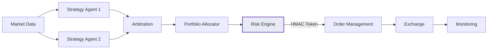

---
hide:
  - navigation
---

# Autonomous Investment Swarm

**Risk-gated autonomous trading with multi-agent orchestration.**

AIS coordinates specialist strategy agents through a governed execution pipeline where every order requires cryptographic risk approval before submission. The system fails closed — not open.

<div class="grid-container" markdown>

<div class="grid-item" markdown>
### :material-shield-lock: Risk-Gated Execution
Every order requires an HMAC-signed approval token from the risk engine. No token, no trade. The system fails closed.
</div>

<div class="grid-item" markdown>
### :material-robot: Multi-Agent Orchestration
Multiple strategy agents compete to generate signals. Weighted arbitration selects the best signal based on confidence, return, and liquidity.
</div>

<div class="grid-item" markdown>
### :material-file-document-check: Mandate Governance
Strategies operate within explicit mandates that cap allocation, restrict instruments, and enforce position limits.
</div>

<div class="grid-item" markdown>
### :material-swap-horizontal: Multi-Exchange
Route orders across Aster DEX, Binance, Coinbase, Bybit, and Interactive Brokers through a unified exchange abstraction.
</div>

<div class="grid-item" markdown>
### :material-test-tube: Three Execution Modes
Paper (simulated), Shadow (read-only), and Live (gated). The same pipeline runs in all modes — what you test is what you deploy.
</div>

<div class="grid-item" markdown>
### :material-chart-line: Full Observability
Prometheus metrics, Grafana dashboards, Alertmanager integration, structured JSON logging, and position reconciliation.
</div>

</div>

## Quick Start

```bash
# Clone and install
git clone https://github.com/kmshihab7878/Financial-Intelligence-Department-FID.git
cd Financial-Intelligence-Department-FID
pip install -e ".[dev]"

# Configure
cp .env.example .env
# Set AIS_RISK_HMAC_SECRET at minimum

# Run in paper mode
python -m aiswarm --mode paper
```

[Get Started](getting-started/installation.md){ .md-button .md-button--primary }
[Architecture](architecture/overview.md){ .md-button }
[API Reference](reference/api.md){ .md-button }

## How It Works



## What Makes AIS Different

| Feature | AIS | Typical Trading Bots |
|---------|-----|---------------------|
| Risk validation | HMAC-signed approval tokens, fail-closed | Basic stop-loss |
| Agent architecture | Multi-agent with weighted arbitration | Single strategy |
| Governance | Mandate system with allocation caps | None |
| Execution safety | 3 modes sharing same pipeline | Live-only or separate codepaths |
| Observability | Prometheus + Grafana + reconciliation | Log files |
| Exchange support | 5 exchanges, unified abstraction | 1-2, hardcoded |
| Audit trail | Append-only event store + decision log | None |

## License

Apache License 2.0. See [LICENSE](https://github.com/kmshihab7878/Financial-Intelligence-Department-FID/blob/main/LICENSE).
