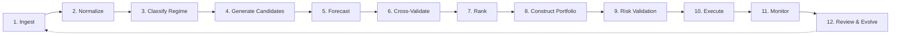

# Operating Model

!!! note
    This document describes the target operating model. Not all steps are fully implemented in the current codebase. The system is an experimental scaffold under active development.

## 12-Step Operating Loop

1. **Ingest** — Market, macro, fundamental, technical, and alternative data
2. **Normalize** — Enrich data into canonical entities
3. **Classify** — Market regime, liquidity state, and volatility context
4. **Generate** — Candidate opportunities across strategies and assets
5. **Forecast** — Distributions, scenario ranges, and confidence
6. **Cross-validate** — Candidate theses across specialist agents
7. **Rank** — Opportunities by expected return, confidence, liquidity, and regime fit
8. **Construct** — Portfolio under portfolio-level constraints
9. **Risk validate** — Pre-trade risk checks and veto
10. **Execute** — Cost-aware routing and scheduling
11. **Monitor** — Fills, exposure, P&L, health, and incidents in real time
12. **Review** — Attribution, drift detection, challenger tests, and evolution under governance

## Governance Model

Humans define the operating boundaries:

- **Mandates** — Allowed assets, strategies, allocation caps
- **Risk budgets** — Drawdown limits, leverage ceilings, exposure caps
- **Compliance constraints** — Instrument restrictions, trading hours
- **Override conditions** — Kill switch, manual pause, forced deleverage

AIS operates within these boundaries and escalates incidents or policy breaches.

## Current Implementation Status

| Step | Status | Module |
|------|--------|--------|
| Ingest | Implemented | `data/`, `exchange/` |
| Normalize | Implemented | `data/providers/` |
| Classify | Partial | `agents/market_intelligence/` |
| Generate | Implemented | `agents/strategy/` |
| Forecast | Partial | `quant/` |
| Cross-validate | Via arbitration | `orchestration/` |
| Rank | Implemented | `orchestration/arbitration.py` |
| Construct | Implemented | `portfolio/` |
| Risk validate | Implemented | `risk/` |
| Execute | Implemented | `execution/` |
| Monitor | Implemented | `monitoring/` |
| Review | Implemented | `review/` |
