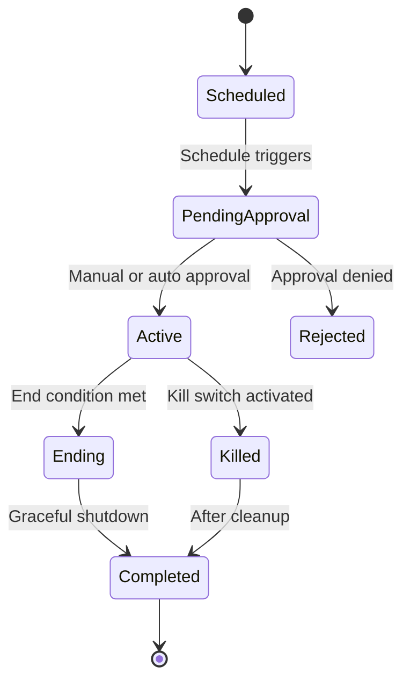

# Session Lifecycle

AIS operates in discrete trading sessions with a defined lifecycle.

## Session States

## Lifecycle Stages

### Scheduled
The session is configured but not yet active. Scheduling can be time-based or manual.

### Pending Approval
The session awaits approval before trading begins. This gate ensures human oversight of session parameters (mandates, risk limits, strategies).

### Active
The trading loop is running. Each cycle:

1. Fetch market data
2. Run strategy agents
3. Arbitrate signals
4. Allocate portfolio
5. Validate risk
6. Execute approved orders
7. Update monitoring

### Ending
Graceful shutdown initiated. The system:

- Stops generating new signals
- Allows pending orders to complete or cancel
- Takes final portfolio snapshot
- Generates session review

### Killed
Emergency stop via kill switch. All open orders are cancelled immediately.

### Completed
Session is done. A review is generated with:

- P&L summary
- Signal statistics
- Risk events
- Execution quality metrics

## Configuration

Session parameters are set at startup via configuration or API:

- **Strategies** — Which agents are active
- **Mandates** — Allocation limits and instrument restrictions
- **Duration** — Maximum session length
- **Risk budget** — Session-specific risk limits
