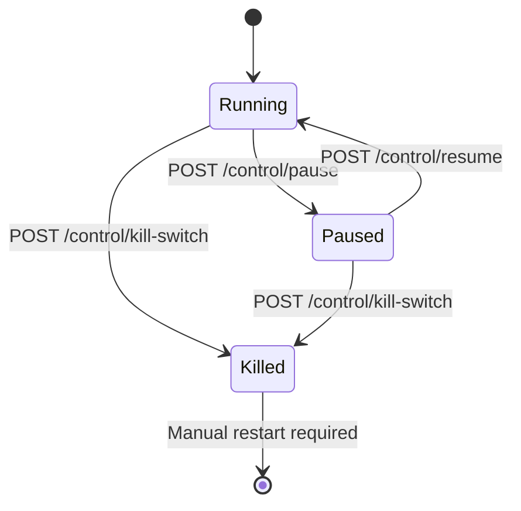

# API Reference

AIS exposes a FastAPI control plane for managing the trading system. The API runs on port 8000 by default.

## Interactive API Docs

FastAPI auto-generates interactive API documentation:

- **Swagger UI**: [http://localhost:8000/docs](http://localhost:8000/docs) — interactive, try-it-out interface
- **ReDoc**: [http://localhost:8000/redoc](http://localhost:8000/redoc) — clean, read-only reference
- **OpenAPI JSON**: [http://localhost:8000/openapi.json](http://localhost:8000/openapi.json) — machine-readable spec

These are available without authentication and always reflect the current API surface.

## Authentication

All control and report endpoints require Bearer token authentication:

```bash
curl -H "Authorization: Bearer $AIS_API_KEY" http://localhost:8000/control/status
```

Set `AIS_API_KEY` in your `.env` file. Generate a secure token:

```bash
python -c "import secrets; print(secrets.token_urlsafe(32))"
```

## Endpoints

### Public Endpoints

These do not require authentication.

#### `GET /health`

System health check with component status.

```bash
curl -s http://localhost:8000/health | python -m json.tool
```

```json
{
  "status": "ok",
  "aster_connected": true,
  "db_connected": true,
  "redis_connected": true
}
```

#### `GET /metrics`

Prometheus-format metrics for scraping. See [Metrics Reference](metrics.md) for the full list.

---

### Control Endpoints (Authenticated)

#### `GET /control/mode`

Returns the default execution mode.

```bash
curl -s -H "Authorization: Bearer $AIS_API_KEY" \
  http://localhost:8000/control/mode
```

```json
{"default_mode": "paper"}
```

#### `GET /control/status`

Returns the current system state.

```bash
curl -s -H "Authorization: Bearer $AIS_API_KEY" \
  http://localhost:8000/control/status
```

```json
{"state": "running"}
```

Possible states: `running`, `paused`, `killed`.

#### `POST /control/pause`

Pause the coordinator loop. Active orders are not cancelled.

```bash
curl -s -X POST \
  -H "Authorization: Bearer $AIS_API_KEY" \
  -H "Content-Type: application/json" \
  -d '{"reason": "manual review"}' \
  http://localhost:8000/control/pause
```

#### `POST /control/resume`

Resume the coordinator loop after a pause. Refused if the system is in `killed` state.

```bash
curl -s -X POST \
  -H "Authorization: Bearer $AIS_API_KEY" \
  http://localhost:8000/control/resume
```

#### `POST /control/kill-switch`

Emergency stop. Prepares cancel instructions for all open orders. Requires manual restart.

```bash
curl -s -X POST \
  -H "Authorization: Bearer $AIS_API_KEY" \
  -H "Content-Type: application/json" \
  -d '{"reason": "drawdown exceeded manual threshold"}' \
  http://localhost:8000/control/kill-switch
```

Response:

```json
{
  "action": "killed",
  "reason": "drawdown exceeded manual threshold",
  "cancel_instructions": [
    {"tool": "cancel_all_orders", "symbol": "BTCUSDT"},
    {"tool": "cancel_spot_all_orders", "symbol": "BTCUSDT"}
  ]
}
```

!!! warning
    The kill switch is a one-way operation. The system must be manually restarted after activation.

#### `POST /control/cancel-all`

Prepare cancel-all-orders instructions for specified symbols.

```bash
curl -s -X POST \
  -H "Authorization: Bearer $AIS_API_KEY" \
  -H "Content-Type: application/json" \
  -d '{"symbols": ["BTCUSDT", "ETHUSDT"]}' \
  http://localhost:8000/control/cancel-all
```

Pass `null` for symbols to cancel across all whitelisted instruments.

#### `POST /control/deleverage`

Prepare a reduce-only order to reduce position exposure.

```bash
curl -s -X POST \
  -H "Authorization: Bearer $AIS_API_KEY" \
  -H "Content-Type: application/json" \
  -d '{"symbol": "BTCUSDT", "reduce_pct": 0.5}' \
  http://localhost:8000/control/deleverage
```

---

### Report Endpoints (Authenticated)

#### `GET /reports/decisions`

Recent decision log entries from the coordinator.

```bash
curl -s -H "Authorization: Bearer $AIS_API_KEY" \
  http://localhost:8000/reports/decisions | python -m json.tool
```

Returns an array of [DecisionLog](decision-log.md) entries.

---

## System State Machine



## Error Responses

All errors follow the standard FastAPI format:

| Status | Meaning |
|--------|---------|
| `401` | Missing or invalid Bearer token |
| `422` | Request body validation error |
| `500` | Internal server error |

```json
{
  "detail": "Not authenticated"
}
```
