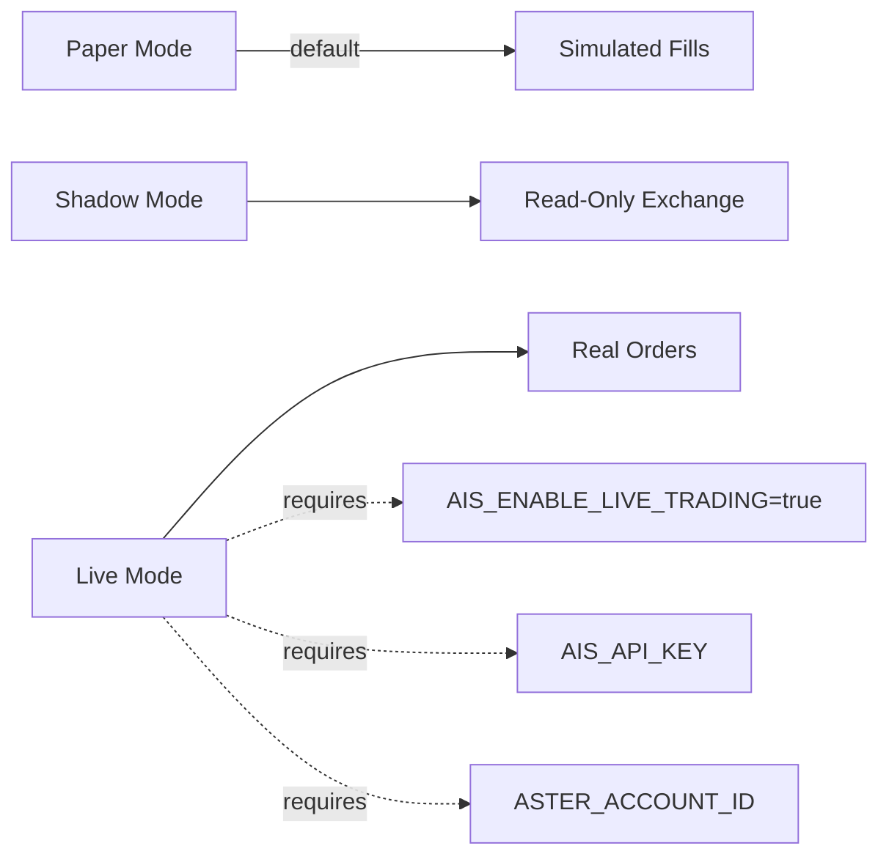

# Configuration Reference

AIS uses YAML configuration files in `config/` and environment variables.

## Configuration Files

| File | Purpose |
|------|---------|
| `base.yaml` | Core system settings (loop interval, log level) |
| `risk.yaml` | Risk limits, drawdown thresholds, leverage caps |
| `execution.yaml` | Execution mode, order routing settings |
| `exchanges.yaml` | Multi-exchange routing, credentials, symbol mapping |
| `integrations.yaml` | TradingView, portfolio trackers, tax export |
| `mandates.yaml` | Strategy mandates, allowed assets, allocation limits |
| `monitoring.yaml` | Alerting, metrics, reconciliation settings |
| `portfolio.yaml` | Portfolio constraints, rebalancing rules |

## Environment Variables

### Required (Always)

| Variable | Purpose | Default |
|----------|---------|---------|
| `AIS_RISK_HMAC_SECRET` | HMAC key for risk token signing | — |
| `AIS_EXECUTION_MODE` | `paper` / `shadow` / `live` | `paper` |
| `REDIS_URL` | Redis connection for control state | `redis://localhost:6379/0` |

### Required (Live Mode)

| Variable | Purpose |
|----------|---------|
| `AIS_API_KEY` | Bearer token for API authentication |
| `AIS_ENABLE_LIVE_TRADING` | Must be `true` to submit real orders |
| `ASTER_ACCOUNT_ID` | Aster DEX account identifier |

### HMAC Key Rotation

| Variable | Purpose |
|----------|---------|
| `AIS_RISK_HMAC_SECRET_PREVIOUS` | Previous HMAC key for zero-downtime rotation |
| `AIS_RISK_HMAC_KEY_ID` | Identifier for current key (default: `v1`) |

### Exchange Configuration

| Variable | Purpose |
|----------|---------|
| `AIS_MCP_SERVER_URL` | Aster DEX MCP server endpoint |
| `AIS_BINANCE_MCP_URL` | Binance MCP server endpoint |
| `BINANCE_API_KEY` | Binance API key |
| `BINANCE_API_SECRET` | Binance API secret |
| `AIS_COINBASE_MCP_URL` | Coinbase MCP server endpoint |
| `COINBASE_API_KEY` | Coinbase API key |
| `COINBASE_API_SECRET` | Coinbase API secret |
| `AIS_BYBIT_MCP_URL` | Bybit MCP server endpoint |
| `BYBIT_API_KEY` | Bybit API key |
| `BYBIT_API_SECRET` | Bybit API secret |
| `AIS_IB_MCP_URL` | Interactive Brokers MCP endpoint |
| `IB_ACCOUNT_ID` | IB account ID |

### Integrations

| Variable | Purpose |
|----------|---------|
| `AIS_TV_WEBHOOK_SECRET` | TradingView webhook HMAC secret |
| `AIS_TV_WEBHOOK_PORT` | TradingView webhook listener port |

### Optional

| Variable | Purpose | Default |
|----------|---------|---------|
| `AIS_SECRETS_FILE` | File-based secrets path (JSON) | — |
| `AIS_SECRETS_DIR` | Directory-based secrets path | — |
| `AIS_DB_PATH` | EventStore database path | `data/ais_events.db` |
| `AIS_LOOP_METRICS_PORT` | Loop Prometheus metrics port | `9002` |
| `AIS_SLACK_WEBHOOK_URL` | Slack alert webhook | — |
| `AIS_ALERT_WEBHOOK_URL` | Generic alert webhook | — |
| `AIS_ALERTMANAGER_URL` | Alertmanager base URL | — |
| `AIS_PUSHGATEWAY_URL` | Prometheus Pushgateway URL | — |

## Execution Modes



| Mode | Exchange Connection | Order Submission | Use Case |
|------|-------------------|------------------|----------|
| `paper` | None | Simulated fills | Development, strategy testing |
| `shadow` | Read-only | Simulated against real prices | Validation before going live |
| `live` | Full access | Real orders | Production trading |

## Example Configs

### Minimal Paper Trading

```yaml
# config/base.yaml
system:
  loop_interval_seconds: 60
  log_level: INFO

# config/execution.yaml
execution:
  mode: paper
```

```bash
# .env
AIS_RISK_HMAC_SECRET=your-secret-here
AIS_EXECUTION_MODE=paper
```

### Multi-Exchange Setup

```yaml
# config/exchanges.yaml
exchanges:
  aster:
    enabled: true
    asset_classes: [spot, futures]
    symbols: [BTCUSDT, ETHUSDT]
  binance:
    enabled: true
    asset_classes: [spot, futures]
    symbols: [SOLUSDT, AVAXUSDT]
```

See the [Multi-Exchange Guide](../guides/multi-exchange.md) for details.
